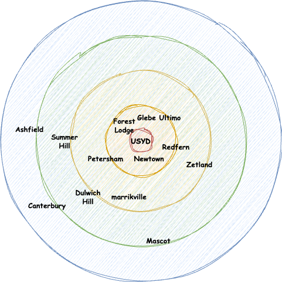

> 아직 입학까지는 시간이 많이 남았지만, 미리 시드니에서의 거주를 준비하고자 한국에서 호주 부동산 웹사이트들을 둘러보며 온라인 집 투어를 해봤던 내용을 간략히 남겨두려 합니다.

## 시드니 유학생들은 어디에 살까?

2026년 8월 입학 예정이고 아직 영어 성적도 따기 전이라🤣 입학까지 정말 많은 시간이 남았지만, 들뜬 마음에 최근 시드니 내 여러 대학의 유학생들이 속한 카카오톡 오픈 채팅방에 들어갔다. 타이밍 좋게 누군가 추천 거주지역에 대해 질문을 남겼고, 아래와 같이 답변을 주고 받았는데, 문뜩 호주에 가게되면 내가 어떤 지역에 살게될지 조금은 더 구체적으로 찾아봐야겠다는 생각이 들었다. 

여담이지만, 위 톡에도 이야기 나왔던 Redfern 지역은 내가 23년 여행 시 두번째 숙소 위치였는데, 호주에 1년가까이 살던 여자친구의 친구를 만나 숙소 위치를 이야기하니 해당 지역이 위험하다며 몇가지 썰들을 이야기 해주었다. 요지는 애보리진이라고 부르는 호주 원주민들이 거의 무상으로 지낼 수 있도록 정부에서 제공한 아파트가 해당 지역에 있는데, 특별한 직업 없이 마약을 하는 사람들이 거리에 간간히 있어 위험할 수 있다는 이야기 였다. 그 덕에(?) 처음 숙소를 옮기던 날 지하철 역에서부터 패닉이 와서 바들바들 떨었던 기억이 있다ㅎ.. ~(물론 워낙 역근처라 여행 기간동안 위험한 순간은 전혀 없었다.)~

아무튼 나의 조건들을 우선 나열해보고, 톡방에서 나온 지역들의 매물들을 간단히 둘러보는 시간을 가졌다.

## 나에게 맞는 집 찾기

나는 여자친구와 함께 호주로 가는 것을 계획하고 있기 때문에, 학교 기숙사는 처음부터 고려 대상에서 제외했다. 기숙사는 보통 1인 거주를 기준으로 하거나, 커플이 함께 살기엔 공간이나 프라이버시 측면에서 제약이 많기 때문이다. 무엇보다도 렌트 시장에서 더 자유롭게 원하는 조건을 맞춰가며 집을 찾고 싶었다.

내가 생각한 거주 조건은 다음과 같다:

- **주당 렌트비가 최대 $700 이하일 것**
    
    : 두 사람이 함께 부담하는 기준으로, 생활비를 고려했을 때 현실적인 상한선이라 판단했다. 시드니의 물가를 감안하면 저렴한 편은 아니지만, 너무 타협하고 싶지도 않았다.
    
- **학교와 거리가 편도 1시간 이내일 것**
    
    : USYD 캠퍼스까지 대중교통으로 무리 없이 통학 가능한 거리를 우선으로 생각했다. 가능하면 버스나 기차 환승 없이 한 번에 이동할 수 있는 게 이상적이다.
    
- **늦은 시간에도 비교적 안전한 지역일 것**
    
    : 학교에서 도서관이나 스터디 공간에 늦게까지 남아있을 일이 많을 예정이라, 밤에 귀가해도 불안하지 않은 동네를 찾고 싶었다. 치안은 아무리 강조해도 지나치지 않다.
    
- **아파트 고층부를 선호할 것**
    
    : 전망이나 소음, 벌레 등 여러 요소를 고려했을 때 고층이 선호 대상이었다. 호주는 창문 방충망이 없는 경우가 많다고 해서, 이런 점도 고층이 나을 것 같았다.
    
- **학교 또는 도심과 가까운 지역을 선호할 것**
    
    : 생활 편의성을 위해, 시티 중심이나 USYD 인근 동네가 이상적이라고 판단했다. 카페, 식당, 마트, 병원 등 기본적인 시설 접근성이 중요하다.
    
- **적당한 주거 밀도와 주차 가능성**
    
    : 완전 번화가보다는 약간 벗어난 중간지점이 좋을 수도 있다는 생각도 했다. 장기 거주를 고려했기 때문에, 근처 소음이나 공사 여부도 유의했다.
    
- **현대식 건물일수록 좋다**
    
    : 오래된 건물은 벽이 얇거나 난방/환기 문제가 있을 수 있기 때문에, 가능하면 2000년대 이후 지어진 비교적 최근 건물을 선호했다.
    

  

이런 조건들을 정리해 놓고 나니, 막연하게 집을 찾기보다는 기준이 조금씩 명확해졌다. 이후 이 기준들을 가지고 실제 매물 사이트나 커뮤니티에서 지역을 탐색해보기 시작했다

## 시드니 대학교 근처, 거주하기 좋은 지역 정리

위 내용들을 바탕으로 ChatGPT 에 추가적으로 지역을 물어보고 위 톡방에서 이야기 나온 지역들을 리스트로 정리했는데, 해당 지역들에 대한 컨텍스트가 전혀 없어 어디부터 어떻게 봐야할지 전혀 감이 오지 않았다. 따라서 우선은 아래와 같이 USYD를 기점으로 거리순으로 간략히 추천 지역들을 정리해 보았다. 

각 지역별로 ChatGPT 에게 물어본 몇가지 항목들에 대한 설명은 아래와 같다. (자기 멋대로 몇 개 지역은 빼고 몇 개 지역은 추가했는데.. 도움이 될거 같아 우선 남겨둔다.)

| 지역명            | 특색 및 분위기                            | 치안 수준 | 1베드룸 임대료 (주당) | 최신 아파트 여부 |
| -------------- | ----------------------------------- | ----- | ------------- | --------- |
| Newtown        | 활기찬 문화, 다양한 음식점과 카페, 예술적인 분위기       | 양호    | A$350–500     | 제한적       |
| Ultimo         | USYD와 UTS에 인접, 도서관과 쇼핑센터 근접, 편리한 교통 | 양호    | A$400–550     | 일부 있음     |
| Glebe          | 조용하고 여유로운 분위기, 주말 시장과 공원, 학생 친화적    | 양호    | A$400–550     | 제한적       |
| Darlington     | USYD 캠퍼스와 매우 가까움, 조용한 주거 지역         | 양호    | A$450–600     | 일부 있음     |
| Chippendale    | 현대적인 아파트와 쇼핑몰, 예술 갤러리, 활기찬 분위기      | 양호    | A$500–650     | 많음        |
| Redfern        | 최근 재개발로 발전 중, 다양한 문화와 음식점, 교통 편리    | 보통    | A$450–600     | 많음        |
| Ashfield       | 다문화적인 분위기, 쇼핑몰과 음식점 다양, 교통 편리       | 양호    | A$400–550     | 일부 있음     |
| Burwood        | 대형 쇼핑센터, 아시아계 커뮤니티 중심, 교통 중심지       | 양호    | A$450–600     | 많음        |
| Parramatta     | 시드니 서부의 중심지, 대형 쇼핑몰과 비즈니스 지구, 교통 허브 | 양호    | A$400–550     | 많음        |
| Macquarie Park | 대학교와 쇼핑센터 인접, 현대적인 아파트 단지, 조용한 분위기  | 양호    | A$450–600     | 많음        |

추가로 ChatGPT 에서는 렌트 또는 쉐어를 구하기 위한 플랫폼으로 아래와 같은 플랫폼들을 추천해 주었다. 







이번에는 어차피 실제 거주할 매물을 구하는 게 아니라 매물을 살펴보는 게 목적 이므로, realestate.com.au 만을 참고하였다.

## 랜선으로 떠난 시드니 집 투어

시드니 입국 전, 온라인으로 후보 매물을 몇 군데 둘러봤다. 실제 거주를 고려하며 조건을 세워봤고, 아래 집들은 예산, 위치, 조건 등을 고려해 내가 직접 저장해둔 매물들이다. 각 집마다 장단점을 간단히 정리해보고, 마지막엔 지역 기준으로 어떤 곳이 인상 깊었는지도 적어보았다.
### [Petersham – Apartment](https://www.realestate.com.au/property-apartment-nsw-petersham-439697108)

- **집 상태**: 비교적 깔끔하고 밝은 느낌. 리모델링된 듯한 인상.
- **평수**: 1 Bedroom
- **렌트비**: A$440/week    
- **장점**: 교통편 괜찮고 조용한 동네. 시티까지 20~25분.    
- **단점**: 약간 오래된 건물 느낌, 천장이 낮음.
### [Ashfield – Unit](https://www.realestate.com.au/property-unit-nsw-ashfield-441626948)

- **집 상태**: 넓고 햇빛 잘 들어오는 구조    
- **평수**: 1 Bedroom + Balcony    
- **렌트비**: A$650/week    
- **장점**: 넓은 평수에 비해 저렴한 편. 상권도 꽤 잘 형성됨. 주차 1대 포함
- **단점**: 학교까지 거리는 다소 있음. 고층 아님.    
### [Dulwich Hill – Apartment](https://www.realestate.com.au/property-apartment-nsw-dulwich+hill-441645652)
- **집 상태**: 내부 마감 좋고 현대적
- **평수**: 1 Bedroom + Balcony
- **렌트비**: A$570/week    
- **장점**: 조용하고 치안도 좋음. 경전철 접근성 있음.  주차 1대 포함
- **단점**: USYD까지 대중교통 40분 이상.    
### [Newtown – Unit](https://www.realestate.com.au/property-unit-nsw-newtown-441616924)

- **집 상태**: 구조 깔끔, 모던한 주방    
- **평수**: 1 Bedroom    
- **렌트비**: A$540/week    
- **장점**: USYD 도보권, 카페/편의시설 풍부    
- **단점**: 약간 낡은 인테리어. 시끄러울 수 있음.    
### [Ultimo – Flat **(영주권자 한정)**](https://www.realestate.com.au/property-flat-nsw-ultimo-441253668)

- **집 상태**: 최신 리노베이션, 내부 훌륭함    
- **평수**: 1 Bedroom    
- **렌트비**: A$504/week    
- **장점**: 도심 접근성 최고, 컨디션도 우수    
- **단점**: **영주권자만 지원 가능** 매물로 추정됨. 일반 신청 불가.    
### [Petersham – Unit](https://www.realestate.com.au/property-unit-nsw-petersham-441246716)
- **집 상태**: 중간 정도 컨디션, 마루 바닥    
- **평수**: 1 Bedroom    
- **렌트비**: A$450/week    
- **장점**: 접근성 괜찮고 가격도 준수    
- **단점**: 인테리어 다소 오래된 느낌    
### [Chippendale – Apartment](https://www.realestate.com.au/property-apartment-nsw-chippendale-441522404)

- **집 상태**: 모던하고 고급스러운 인테리어    
- **평수**: 1 Bedroom    
- **렌트비**: A$625/week    
- **장점**: USYD 도보 거리, 센트럴역 인근, 생활 편의시설 많음    
- **단점**: 비교적 비싼 가격대. 치안은 지역마다 다름.    
## 📝 임장 중 알게 된 팁

- **영주권자 전용 매물 주의**: 위 Ultimo 매물처럼 **정부 보조나 영주권자 한정 매물**도 있다. 좋아 보여도 일반 학생은 계약이 안 될 수 있으니 꼭 조건을 읽자. 
- **Furnished 조건 해제 필수**: 매물 검색 시 기본적으로 ‘Furnished’가 체크되어 있어서 좋은 매물이 안 보이는 경우가 많았다. 체크 해제하니 **가격대비 훨씬 좋은 매물**이 많아졌다. 장기 거주라면 가구 없이 시작하는 것도 충분히 고려해볼 만하다.
  
## 정리하며.. 

여러 매물을 둘러봤지만, **Newtown**과 **Chippendale**이 가장 인상 깊었다. Newtown은 학교와의 거리, 생활 편의성, 분위기 모두 균형 잡혀 있었고, Chippendale은 도심 속 모던한 분위기와 편리함이 매력적 이었다.

물론 각 매물의 조건은 시기에 따라 달라지고, 개인의 우선순위(예산, 공간, 위치 등)에 따라 해석도 다를 수 있다. 하지만 직접 이렇게 하나씩 살펴보며 온라인 임장을 해보니, 실제 시드니 생활에 대한 감이 더 명확해졌다는 점이 가장 큰 수확이었다.

이번 기회로 대략적으로 주변 거주 가능한 지역들이 어디가 있는지, 또 각 지역별로 매물은 어떻게 형성되어 있는지 감을 대략적으로 익힐 수 있었던 것 같다. 앞으로 또 시간이 날 때 다른 플랫폼을 통해서도 매물을 추가로 더 찾아보고 해당 블로그를 통해 남겨보려 한다.