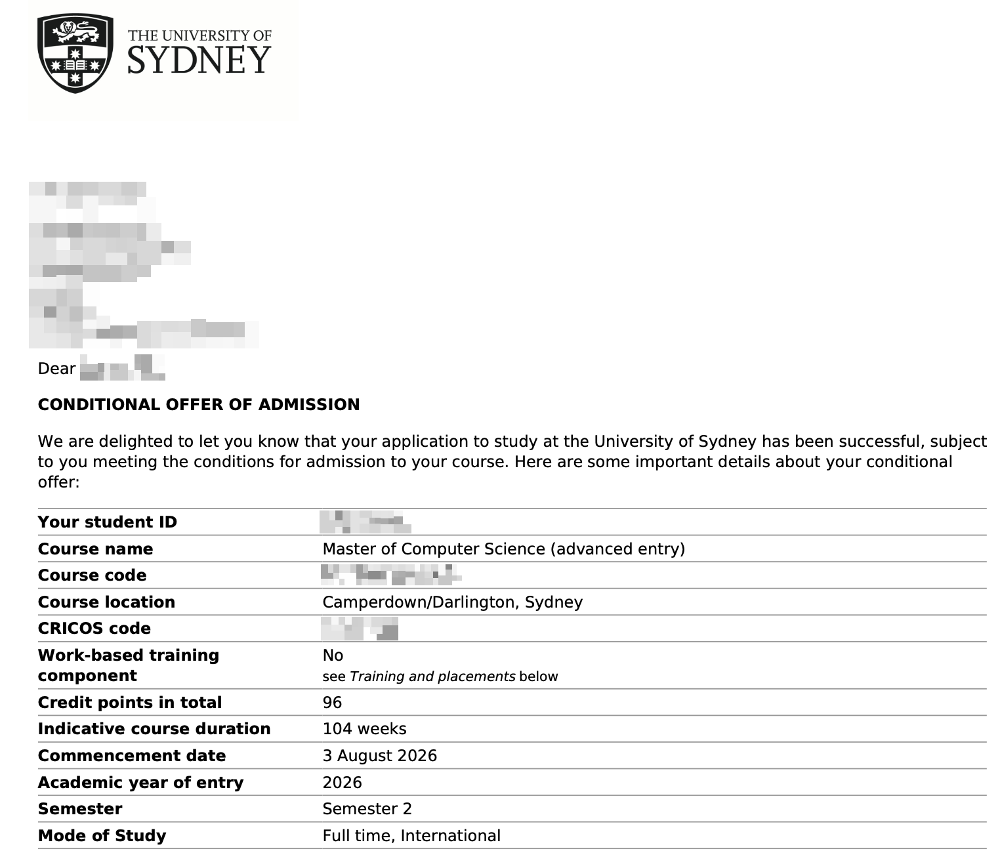
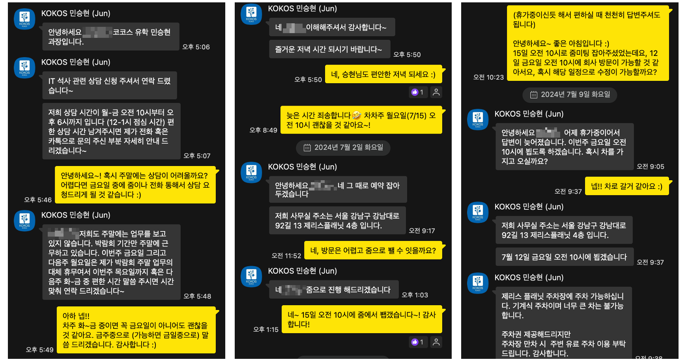
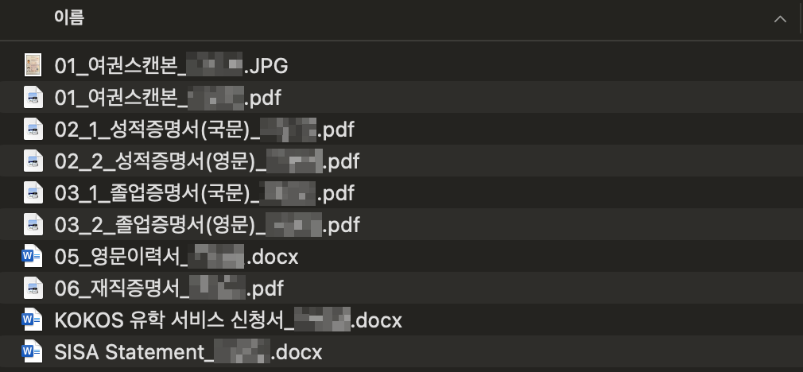

 > 2025년 4월 29일자로 지원했던 USYD 로 부터 조건부 합격 연락을 받은 기념(?)으로, 이제껏 호주 유학을 준비하며 진행했던 내용들을 간략히 글로 남겨보려 합니다.

## 호주 대학원에 지원하기까지
### 왜 나는 유학/이민을 택했을까

관련해서 기존에 수많은 블로그 플랫폼을 전전하다 아주 짧게 정착했던ㅎ.. 티스토리 블로그에 장황한 배경을 적어둔 적이 있다. 간략하게 내용을 요약하자면 아래와 같이 정리될 것 같다.
- 대학 입시부터 취준, 첫 취업 및 이직까지 중간에 뜨는 기간 없이 원하는 분야에 일을 하고 있음에도, 현재까지의 내 삶에 감사하기 보다 한국인으로써 겪어야 할 다음 단계들이 걱정으로 다가왔다.
- 카투사를 지내며 겪은 간접적인 해외 업무 경험이 나에게 더 맞는다 생각했고, 서핑과 태닝을 취미로 갖는 사람으로써 바다 가까운 지역에서 지내고 싶다는 생각도 있었다.
- 또 지금 다니는 회사는 대학 입학 때부터 꿈에 그리던 회사임에도 불구하고, 지나치게 경쟁적이고 항상 업무가 많은 편이다. 보다 덜 경쟁적인 환경에서, 회사를 제외한 나의 삶을 좀 더 누릴 수 있는 환경에서 지내고 싶었다. '나'라는 사람을 설명하는 데 직장을 빼면 너무 작아지는 느낌이 싫었다.

생각을 글로 정리할 때마다 느끼는 것은, 내가 한국인이기 때문에 겪는 갈증 이라기 보다는 나의 생각과 가치관에 기인한 불편함 이라는 점이다. 원인이야 어떻든 한 해라도 젊은 나이에, 하나라도 잃을 게 적을 나이에 원하는 삶을 향해 도전해 보는 게 길게 보았을 때 후회가 적을 거란 생각이 들었다.

### 호주를 택한 이유

그렇다면 흔히들 가는 미국이 아닌 왜 호주를 선택했을까. 앞서 말했듯이 이민을 생각한 원인 중 하나가 경쟁사회에 지쳤다는 점인데, 미국은 크게 다를 것 같지 않았다. 보상은 우리 나라보다 확실한 편이라 생각되지만, 영주권을 받기까지의 과정도, 영주권을 받은 후의 삶도 한국 못지 않게 경쟁적일 거라는 생각이 들었던 것 같다. 

그리고 결정적으로, 23년 12월 방문한 시드니에서의 기억이 너무 좋았다. 8살, 9살 때 미국을 짧게 경험 해보긴 했지만 워낙 어렸고, 그래도 성인 이후 경험한 미국은 카투사 때가 전부인데 군인 임에도 불구하고 뚱뚱한 사람들이 꽤 있었던 걸로 기억한다. 하지만 시드니는 많은 사람들이 아침 일찍부터 나와 조깅을 하고, 해변가에는 서핑을 즐기는 "건강미" 있는 사람들이 가득했다. (나중 이야기지만, 24년에는 멜버른과 브리즈번을 방문했는데, 두 도시의 사람들의 체형은 시드니와는 달랐다. 아마도 시드니에서의 기억이 왜곡된 것도 없지 않아 있을 것 같다.)

여행당시의 경험과 이후 대학을 지원하며 찾아본 나에게 있어 (환상 속의) 호주의 이미지는, 커피를 사랑하고, 바다와 자연을 즐기며, work & life balance 가 보장되는, 따라서 가족과 더 많은 시간을 보낼 수 있는 나라이다. 이런 나의 환상과 별개로 영어권 국가에서 비교적 영주권에 도전하기 용이한 국가중에 하나라는 점도 선택에 큰 영향을 주었다.

### 지원 전 계획 세우기

지금에야 조건부 합격 연락을 받고 영어 성적 준비 등을 진행하려 하지만, 처음에는 영주권을 받기 위한 스트림이 뭐가 있는지.. 또 여자친구와 같이 호주로 넘어가길 계획하고 있는데 이를 위한 방법은 뭐가 있는지 전혀 모르는 상황이었다. 우선 관련한 다양한 지식을 습득하기 위해 Chat GPT 에게도 물어보고, 유학원도 방문하고, 인터넷 상에도 찾아보고, 오픈 톡방에도 들어가는 등 다양한 방법을 시도했던 것 같다. 대단한 계획과 함께 유학 준비를 한건 아니라서, 이제와 굳이 정리를 해보자면 다음과 같은 순서로 계획했던 것 같다.

- 오픈 톡방, 유학 박람회 등을 통해 최대한 많은 정보 듣기
- 영주권을 받을 수 있는 다양한 스트림에 대해 이해하고, 나(그리고 여자친구)에게 가장 맞는 스트림 고르기
- 전체적인 목표 일정 및 마일스톤 잡기
- 유학원 선정 및 학교 지원, 영어 성적 및 추가 보충 서류 준비하기
- ...

아직도 진행 중에 있고, 영어 성적을 비롯해 앞으로 진행할 내용들은 요기 개설한 블로그를 통해 틈틈히 남겨보려고 한다. 이제껏 진행된 내용에 대해서는 아래와 같이 정리해 보았다. 

## 본격적인 준비 과정
### 호주 유학 박람회에 가다

관심을 가지고 찾아보니, 한국에서도 꽤 잦은 주기로 "호주 유학 박람회"를 개최하고 있었다. 호주 영주권 취득과 관련해서 정보가 아예 없는 상태여서 아주 가벼운 마음으로 24년 6월쯤 코엑스에서 KOKOS에서 주관한 유학 박람회에 아주 가벼운 마음으로 참가했었다. 



박람회 제목에서 유추할 수 있듯이, 국가를 기준으로는 호주와 뉴질랜드를 대상으로 유학 관련 부스를 운영하고 있었고, 1시간 단위로 세션을 통해 워킹 홀리데이, 기술 이민, 어학 연수 등을 주제로 부스에 계신 분들이 돌아가며 강연을 해주시는 형태였다. 추가로 각 부스에는 여러 학교들이 나와있기도 하고 (UTS, Monash, ...) 유학원 직원분들도 나와 상담을 진행해주시기도 했다.해당 박람회를 다녀와 얻은 수확은 아래와 같다. 

- 호주 이민은 큰 틀에서 점수를 기반으로한 (1)기술 이민과 (2)취업 이민 두가지가 있다.
- 직업군에 따라 이민에 유리한 직업군과, 그렇지 않은 직업군이 있으며 이는 별도의 리스트를 통해 관리된다.
- 학교 진학을 통해 이민을 준비하는 경우, 학생비자 -> 졸업비자 -> 임시 취업 비자 -> 영구 취업 비자를 통해 영주권을 취득할 수 있다.
- KOKOS 상담 부스에 계신 **"민승현"** 님께 가벼운 상담 후 추후 유학 준비를 이어서 진행하기로 결정했다.

### 유학원 선정

유학 박람회 때 상담을 받았던 민승현님께 DM을 통해 미팅을 잡고 첫 상담을 진행했다. 유학 및 취업 이민으로 방향을 잡고, 아래와 같은 이야기들을 나눴던 것 같다.

- 영주권이 목표라면 진학할 학교와 취업·정착할 도시를 일치시키는 것이 유리함
- 석사 과정은 Coursework 과 Research 과정이 있으며, Coursework 과정의 경우 동일한 학부 전공 졸업이 필요한 일부 Advanced 과정을 제외하고는 학부 전공과 관계없이 들을 수 있음
- 시드니 주요 대학으로는 USYD, UNSW, UTS, 맥쿼리대가 있으며, UNSW 를 제외하고는 20% 정도 장학금을 받을 수 있음.
- 석사 입학 시 가장 중요한 요소는 학부 성적이며, 그 외 경력, CV, GS, SOP 등이 필요할 수 있음.  
- 영어 성적 없이도 석사 과정에 미리 지원 가능하고, 합격 후 성적 제출 및 입학 연기도 1회까지 가능함.
- 입학 시기는 2026년 3월로 설정하고, 2025년에 미리 지원하는 것이 전략적으로 유리함.   
- 졸업 후 영주권까지는 학생비자 → 졸업비자(485) → 임시취업비자(482 등) → 영주권(186/189 등) 순서가 일반적 경로임.   

### 나에게 맞는 학교, 도시 찾기

상담 이후 호주 내에는 도시별로 어떤 학교들이 있고, 각 학교 사이트를 방문하여 어떤 석사 전공을 선택할 수 있는지 살펴보았다. 앞서 상담 통해 "Advanced" 과정의 존재를 들은 이후, 해당 과정을 제공하는 학교를 더 높은 우선순위로 두고 후보 리스트를 작성했다. 
추가로 졸업 이후 나는 시드니 지역에 거주를 희망 하므로, 시드니 지역을 위주로 대학 리스트를 선별했다. 여담이지만, 앞서 언급한대로 24년 12월 중에 멜버른과 브리즈번을 방문 했었는데, 해당 도시들도 꽤 마음에 들었지만 상대적으로 바다와 접근성이 떨어진다는 점에서 장기적인 관점에서 시드니 내에 있는 대학에 진학하기로 결정짓게 되었다.
이에 따라 내가 선별한 대학, 전공 리스트는 아래와 같다.

| #   | 학교명                | 전공                                                                                                                             |
| --- | ------------------ | ------------------------------------------------------------------------------------------------------------------------------ |
| 1   | USYD (시드니 대학교)     | [Master of CS (Advanced)](https://www.sydney.edu.au/content/courses/courses/pc/master-of-computer-science-advanced-entry.html) |
| 2   | UNSW (뉴사우스웨일스 대학교) | [Master of Data Science & Engineering](https://www.handbook.unsw.edu.au/postgraduate/specialisations/2025/COMPPS)              |
| 3   | UTS (시드니 공과 대학교)   | [Master of IT (Extension)](https://www.uts.edu.au/courses/master-of-information-technology-extension#course-overview) [^1]     |
| 4   | MQ (맥쿼리 대학교)       | [Master of Data Science](https://www.mq.edu.au/study/find-a-course/courses/master-of-data-science)                             |

[^1]: 참고로 Extension 의 경우, 졸업 비자 발급 요건을 충족시켜주기 위해 커리큘럼을 2년으로 맞춘 과정으로, Advanced 와는 다르다.

## 유학원을 통한 지원 과정

대학 목록을 선별한 이후, 유학원에서 요구한 몇가지 양식을 채워 전달 드렸다. 

나의 학업 및 경력 관련 증명 서류들과 지원 학교 및 학과 목록, 장학금 신청서 정도 작성해서 전달 드렸던 것 같다.
아 추가로 앞서 선별한 대학 리스트에서 장학금을 받기 어려운 UNSW 를 제외하고 USYD, UTS, MQ 이렇게 세 개의 대학을 최종적으로 선정 및 신청서를 작성하여 전달 드렸다. 

## 합격 이후 앞으로의 여정

사실 내가 학교를 지원한 지도 몰랐는데.. (KOKOS 와 몇 번의 메일을 오가며 학교 신청 전 구체화 단계가 있을 거라고 생각했었다.🤣) 2~3주 뒤 맥쿼리 대학교와 시드니 대학교 합격 메일을 전달 주셨다!!! 물론 아직 영어 성적도 없어 Conditional Offer 이고, 내년 6월 이후 입학 예정이라 갈길이 멀지만, 진짜로 호주를 가겠구나.. 생각이 들어 매우 들뜬 한주를 보냈던 것 같다.

이후 영어 준비 및 최종 CoE 수령, 유학 준비 등의 과정을 해당 블로그를 통해 꾸준히 기록해볼 예정이다.
